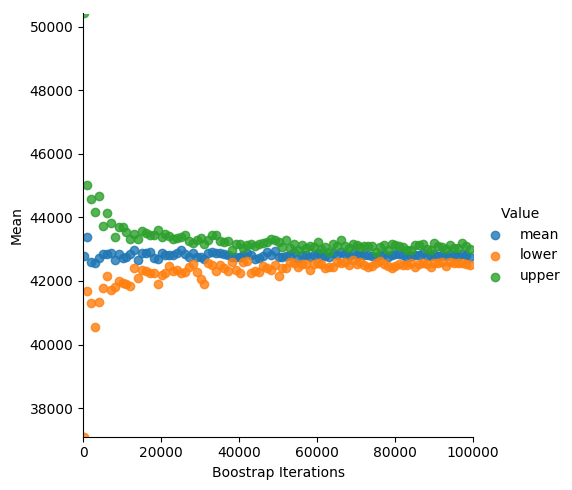

# Excercise lab 2 of CE888

## Reading and Plotting vehicles

On the root folder of lab2, run [vehicles.py](src/vehicles.py) that reads and plots vehicle data:

```
python src/vehicles.py
```

The scatter-plots and the histograms of vehicles will be output to `./out`:


## Bootstrap confidence analysis

This is for calculating the bootstrap confidence as well as showing the
convergence of the bootstrap process.

To run, run [bootstrap.py](src/bootstap.py) using command line with args
- `--ci` as confidence interval, default to 95
- `--out` to specify the output of the plot of the convergence, default to `out/bootstrap_confidence.png`
for example, below command calculates the bootstrap of `data/salaries.csv`
with confidence interval 95 and outputs the convergence plot to `out/salaries_bootstrap_confidence.png`

```
python src/bootstrap.py --ci 95 --out out/salaries_bootstrap_confidence.png data/salaries.csv
```

and it produces a plot like:


## Make comparation for an A-B test

To make a comparation for an A-B test,
a `.csv` is needed in the format of two columns: `current, new`,
each column stores a set of score. The [compare.py](src/compare.py) will
do bootstraping as well as permutation tests between the two score sets and compare.
The command line args for compare.py should be:
- `--ci` as confidence interval of bootstrapping, default to 95
- `nbs` the number of iterations of the bootstrapping, default to 100000
- `npt` the number of iterations of the permutation test, default to 1000
- `acc` the accept rate for the permutation test

e.g, below command compares the two fleets of the vehicle with confidence interval 95, 100000 iterations,
and does permutation tests with accept rate 0.1 with 1000 iterations:

```
python src/compare.py --ci 95 --nbp 100000 --npt 1000 --acc 0.1 data/vehicles.csv
```
the output should be:
```
Bootstrap result on ci:  95  after  100000 iterations
        current |  mean:  20.145538554216866 lower:  20.111897999999997 upper:  20.178256
        new |  mean:  30.48028088607595 lower:  30.449421 upper:  30.506742
newer is better since the p is 0.0
```

## Power Analysis

The power analysis is named as [permutation_test.py](src/permutation_test.py) instead of `power.py`